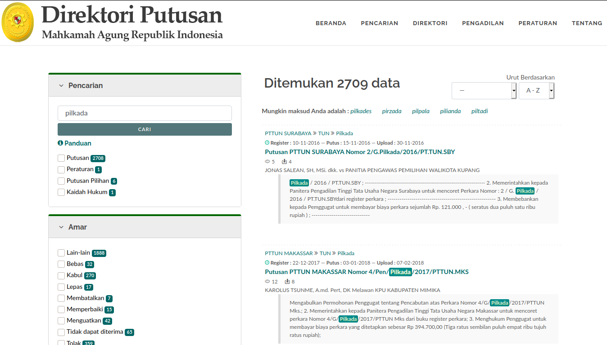
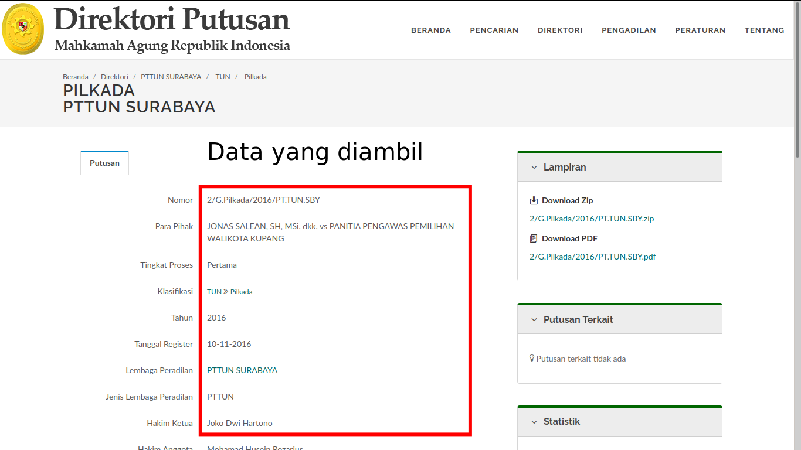
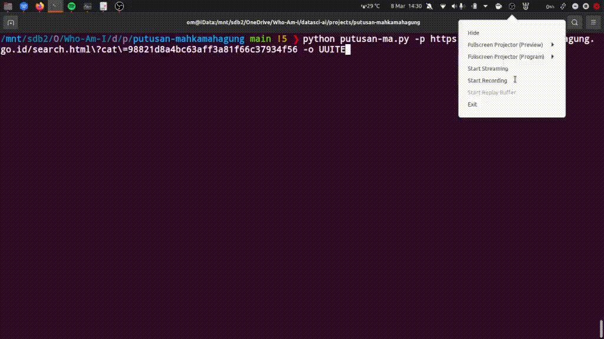

# Putusan Pilkada Mahkamah Agung Indonesia DataScraper


Program ini digunakan untuk scraping data di website [https://putusan3.mahkamahagung.go.id/search.html](https://putusan3.mahkamahagung.go.id/search.html)

Silahkan digunakan / dicopy / dimodifikasi agar menjadi bermanfaat.

Tested di Ubuntu 20.10






## Demo


## Usage
```
usage: putusan-ma.py [-h] -p PAGE [-o FILE_NAME] [-he] [-sp STARTPAGE] [-ep LAST_PAGE] [-sd] [-v]

Putusan Mahkamah Agung Scraper

optional arguments:
  -h, --help            show this help message and exit
  -p PAGE, --page PAGE  Masukkan link pencarian putusan pilkada
  -o FILE_NAME, --output FILE_NAME
                        masukkan nama output file, misal UUITE
  -he, --headless       (optional) headless
  -sp STARTPAGE, --startpage STARTPAGE
                        masukkan start page
  -ep LAST_PAGE, --endpage LAST_PAGE
                        masukkan end page
  -sd, --sortdate       (optional) sort date
  -v, --verbose         increase output verbosity
```

## How to use
```
git clone https://github.com/okkymabruri/putusan-mahkamahagung
cd putusan-mahkamahagung/
pip install -r requirements.txt
python putusan-ma.py -p https://putusan3.mahkamahagung.go.id/search.html?cat=98821d8a4bc63aff3a81f66c37934f56 -o putusanUUITE
```

## Thanks to:
* [Perhimpunan Pengembangan Media Nusantara](https://ppmn.or.id/)
