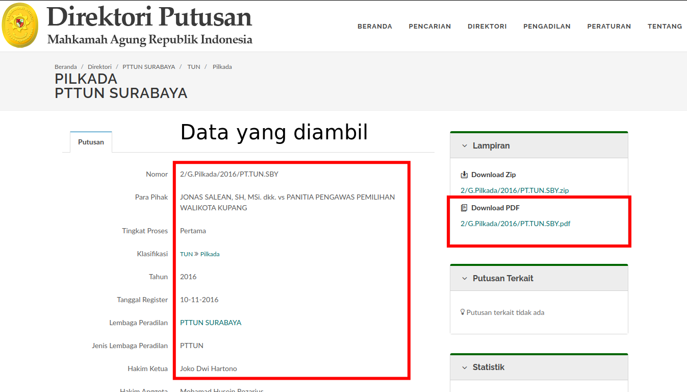

# Putusan Mahkamah Agung / Supreme Court Data Scraper


This code is used for scraping data on the website: [https://putusan3.mahkamahagung.go.id/search.html](https://putusan3.mahkamahagung.go.id/search.html)

Feel free to copy/modify.




## Usage
```
usage: putusan-ma.py [-h] -k KEYWORD [-sd]

Putusan Mahkamah Agung Scraper

optional arguments:
  -h, --help            show this help message and exit
  -k KEYWORD, --keyword KEYWORD
                        keyword for the Supreme Court
  -sd, --sortdate       (optional) scraping from newest putusan. Default False
```

## How to use
```
git clone https://github.com/okkymabruri/putusan-mahkamahagung
cd putusan-mahkamahagung/
pip install -r requirements.txt
python putusan-ma.py -k "korupsi"
```

Tested di Ubuntu 21.10